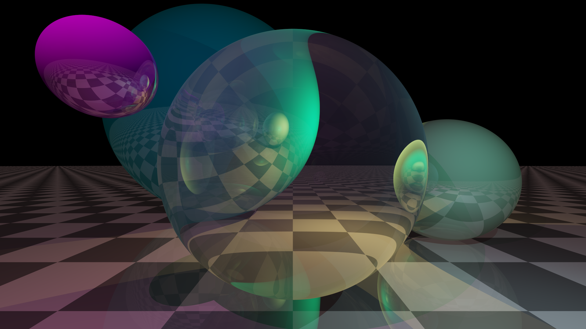
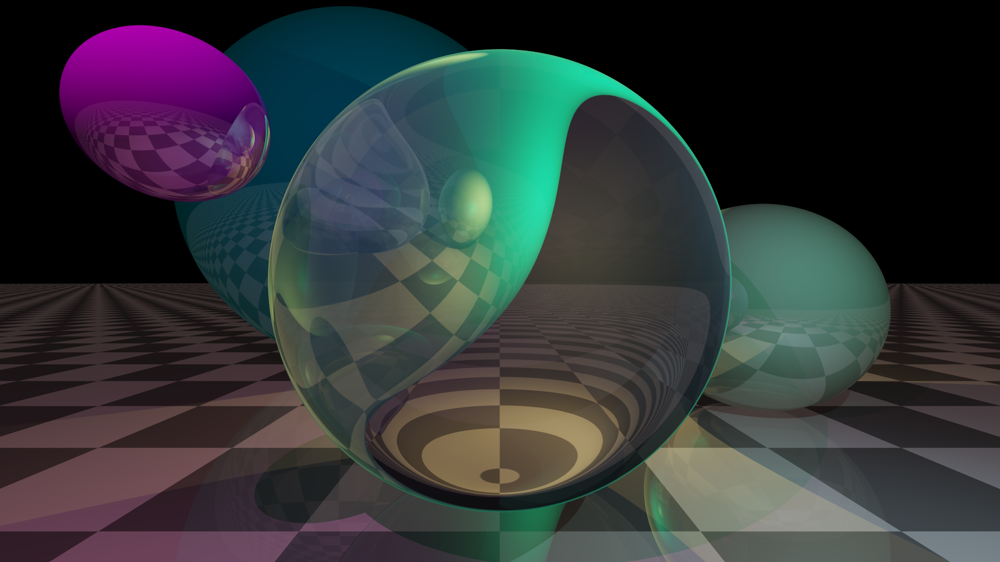

# C Bad Sphere Tracer

This is a project I've been working on since I started learning C in order to have a better grasp on the language.  This code implements a rudimentary sphere tracer written in pure C with the goal of being able to render images within a reasonable amount of time on a Raspberry Pi 4 Revision 4.  Some example renders are included below.

## Implemented Features
- Solid diffuse color
- Reflection
- Refraction
- Transmission
- HDRI support
- Raytraced shadows (treats all objects as opaque)

## Quickstart

Clone the repository and run `make png` to render the scene to `output.png`.

## Example Renders
This was rendered with an incorrect implementation of refraction.

This was rendered with a corrected implementation of refraction.

This was rendered with the provided HDRI, with luminance tonemapping.

This was rendered with the provided HDRI, with ACES tonemapping.

This was rendered with the provided HDRI, with ACES tonemapping in 4k.
