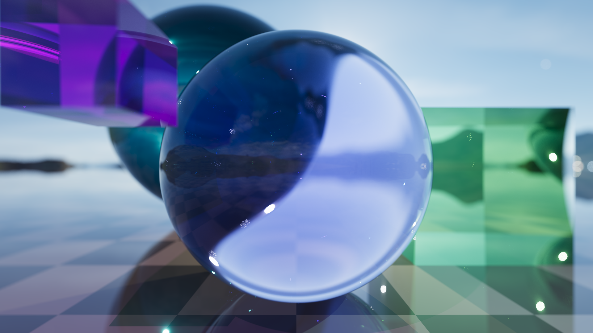
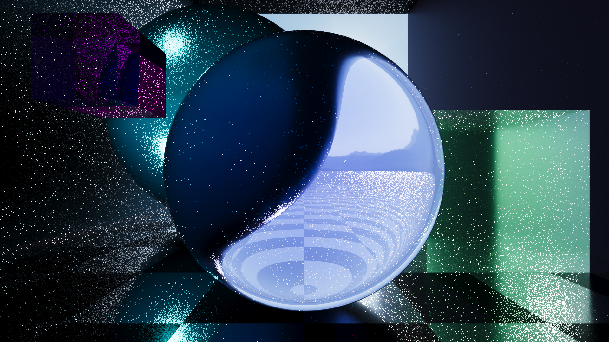

# C Bad Sphere Tracer

This is a project I've been working on since I started learning C in order to have a better grasp on the language.  This code implements a rudimentary sphere tracer written in pure C with the goal of being able to render images within a reasonable amount of time on a Raspberry Pi 4 Revision 4.

The rendering methods have been reworked over time.  Currently, scenes are rendered using a Monte Carlo method with Russian Roulette termination.  The code has been written to run on devices other than solely a Raspberry Pi 4 Revision 4, although all example renders were generated on such one.  Scenes can be rendered directly to the terminal using ANSI color codes, or to .ppm, which can then be converted to .png using [Netpbm's `pnmtopng`](https://netpbm.sourceforge.net/).  The `pnmtopng` program is automatically compiled upon the first `make png` and is then reused for subsequent runs.

Some example renders are included below.

## Implemented Features
- Multithreading
- Monte Carlo method
- Render to terminal (full color)
- Render to .ppm
- Render to .png
- Solid diffuse color
- Reflection
- Refraction
- Transmission
- HDRI support
- Raytraced shadows (treats all objects as opaque)

## Quickstart

Clone the repository and run `make png` to render the scene to `output.png`.

## Example Renders
Whitted.  Diffuse, reflection, and refraction; however, no Fresnel or HDRI support.  Clamp tonemapping.

Whitted.  Diffuse, reflection, and refraction with Fresnel and HDRI support.  Luminance tonemapping.

Whitted.  Cubes in scene with rendering artifacts.  Diffuse, reflection, and refraction with Fresnel and HDRI support.  ACES tonemapping.

Whitted.  Cubes in scene with rendering artifacts.  Diffuse, reflection, and refraction with Fresnel and HDRI support.  ACES tonemapping.  Rendered in 4K.

Monte Carlo with 1024 samples-per-pixel.  Cubes in scene.  Diffuse, reflection, and refraction with Fresnel and HDRI support.  Reflect if ray cannot be refracted.  ACES tonemapping.

Monte Carlo with 65536 samples-per-pixel.  Same as above, but with depth of field and bokeh effect.  ACES tonemapping.

Monte Carlo with 4096 samples-per-pixel.  Testing roughness with GGX.  ACES tonemapping.
